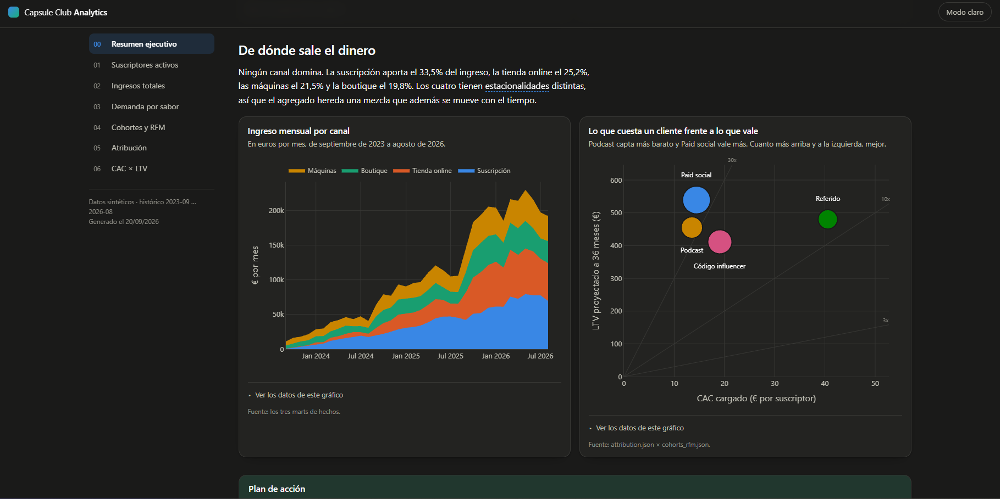
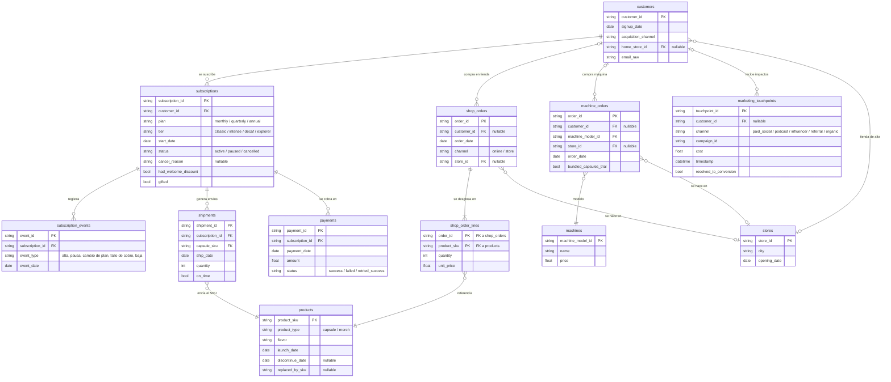

# Capsule Club Analytics

### 👉 **[Ver el informe interactivo en vivo](https://diegoprieto23.github.io/capsule-club-analytics/)**

[](https://diegoprieto23.github.io/capsule-club-analytics/)

---

## About

Proyecto de analítica de extremo a extremo sobre un negocio simulado de café en
cápsulas. Cubre el recorrido completo: generación del dataset, modelado en dbt
sobre DuckDB, seis análisis en Python y un informe HTML interactivo de siete
páginas como entregable.

**Qué hace, en cuatro piezas:**

1. **Genera** un negocio sintético de tres años y 280.841 filas en doce tablas
   —club de suscripción, tienda online, boutiques y venta de máquinas— con
   defectos inyectados a propósito: roturas de stock, una semana de cobros
   perdida, clientes duplicados y un canal de marketing que deja de ser medible
   durante medio año.
2. **Modela** ese dato en bruto hasta siete tablas analíticas, pasando por una
   capa de limpieza y otra de lógica de negocio, con 220 comprobaciones
   automáticas que se ejecutan en cada build.
3. **Analiza** sobre esas tablas cuatro técnicas que se encadenan —series
   temporales, forecasting validado contra el pasado, cohortes y RFM, y
   atribución de marketing multimodelo— hasta el cruce que las cierra: CAC por
   canal contra el LTV que ese canal acaba dejando.
4. **Publica** un informe HTML estático de siete páginas: gráficos Plotly con su
   tabla de datos debajo, modo claro y oscuro, y 25 recomendaciones, cada una
   con la cifra que la sostiene.

La pregunta que hilan los siete capítulos es una: **qué canal de captación
conviene** cuando se mide por lo que el cliente acaba dejando y no por lo que
cuesta traerlo. La respuesta cambia el orden del ranking.

**Stack:** Python 3.13 · DuckDB · dbt · pandas · statsmodels · Plotly.
Todo se ejecuta en local, sin servicios de pago.

## El negocio simulado

Capsule Club es una marca de café en cápsulas que no existe. Vende de cuatro
formas a la vez: un club por suscripción que manda cápsulas cada mes, una tienda
online, unas cuantas boutiques físicas y máquinas de café como compra puntual.

El negocio está simulado entero —tres años de historia, 280.000 filas— para
poder hacer con él lo que se hace con los datos de un negocio real: entender qué
está pasando, predecir qué va a pasar y decir qué habría que cambiar.

El resultado es **un informe de siete páginas** que empieza por un resumen
ejecutivo y termina en un plan de acción. Cada página cuenta un hallazgo, lo
demuestra con un gráfico y acaba en recomendaciones concretas: qué hacer, por
qué, cuánto vale y con qué métrica se sabrá si funcionó.

## Qué pretende demostrar

El foco no está en montar el *pipeline*, sino en lo que viene después: leer los
datos, encontrar lo que importa, comprobar que es cierto y contarlo de forma que
alguien pueda decidir con ello. Tres rasgos del proyecto sirven a eso:

- **Los datos están rotos a propósito.** Hay roturas de stock que parecen falta
  de demanda, una semana de cobros perdida por una migración, suscripciones
  regaladas mezcladas con las de verdad, un canal de marketing que dejó de ser
  medible durante medio año y clientes duplicados por escribir el mismo email de
  dos maneras. Ninguna de esas anomalías viene señalada. Detectarlas, medir su
  efecto y documentarlas en el informe —en vez de corregirlas en silencio— forma
  parte del análisis.
- **Cada conclusión se comprueba.** Las predicciones se ponen a prueba contra el
  pasado antes de publicarlas, y se dice cuánto se equivocan. Los rankings se
  recalculan cambiando los criterios para ver si aguantan.
- **Todo termina en una decisión.** 25 recomendaciones repartidas por las siete
  páginas, cada una con el número que la justifica.

## Qué hay dentro del informe

| Página | Qué responde |
|---|---|
| **Resumen ejecutivo** | Las cinco cosas que más dinero mueven, ordenadas por lo que devuelven frente a lo que cuestan |
| **Suscriptores activos** | Cuántos hay, cuántos habrá dentro de seis meses y con cuánto margen de error |
| **Ingresos totales** | De dónde sale el dinero, cómo cambia el reparto entre canales y dónde se escondía una semana de cobros perdida |
| **Demanda por sabor** | Cuántas cápsulas de cada sabor comprar, con las roturas de stock descontadas |
| **Cohortes y RFM** | Cuánto dura un cliente, qué le hace irse y qué grupos de compradores merecen un trato distinto |
| **Atribución** | A qué canal hay que darle el mérito de cada alta, y cuánto marketing no se puede atribuir a nadie |
| **CAC × LTV** | Lo que cuesta captar un cliente contra lo que acaba dejando, canal por canal |

### Algunos de los hallazgos

- **El canal más barato no es el que más vale.** El podcast capta suscriptores
  por 13,52 € y *paid social* por 14,44 €, pero el segundo retiene diez puntos
  mejor al año y acaba dejando más (37,3x contra 33,7x). Ordenar los canales por
  coste de captación da el orden inverso al de valor.
- **El 39,4% del marketing no se puede atribuir a ninguna conversión.** No es
  gasto perdido, pero tampoco optimizable: se desconoce a quién llegó. Cargar
  ese gasto huérfano sobre las altas sube el CAC medio de 11,71 € a 14,53 €, y
  no lo hace por igual en todos los canales —*paid social* sube un 44%—, así que
  reordena el ranking.
- **Seis roturas de stock** dejaron sin vender 17.119 € de cápsulas. Tres cayeron
  en los últimos siete meses, justo en el arranque de la previsión: corregirlas
  sube un 15,3% la demanda prevista de Intenso 10, porque el modelo estaba
  leyendo como falta de interés un cero que era falta de existencias.
- **El descuento de bienvenida acorta la vida del cliente en 5,1 meses** (16,7
  frente a 21,8) y resta unos 128 € de LTV por alta. En vez de fidelizar,
  selecciona: separa a quien iba a quedarse de quien venía por el descuento.
- **274 cancelaciones se originan en un cobro fallido**, no en una decisión del
  cliente, y no hay ningún intento de recuperación registrado.

## Los datos

280.841 filas repartidas en doce tablas, desde septiembre de 2023 hasta agosto
de 2026. Las genera un script con semilla fija, así que dos ejecuciones producen
exactamente lo mismo.

| Tabla | Filas | Qué es |
|---|---:|---|
| `customers` | 12.305 | Clientes, sean suscriptores, compradores o ambos |
| `subscriptions` | 5.110 | Suscripciones al club, con su plan y su estado |
| `subscription_events` | 12.385 | Altas, pausas, cambios de plan, fallos de cobro y bajas |
| `shipments` | 45.508 | Envíos del club, con el sabor de cada cápsula |
| `shop_orders` / `shop_order_lines` | 39.888 / 82.925 | Pedidos de tienda online y boutique |
| `machine_orders` | 3.417 | Ventas de máquinas |
| `payments` | 32.726 | Cobros de las suscripciones |
| `marketing_touchpoints` | 46.541 | Cada contacto de marketing antes de un alta |
| `products` · `machines` · `stores` | 23 · 5 · 8 | Catálogo y tiendas |

### El modelo

Los datos entran en bruto y salen en siete tablas listas para analizar. En medio
hay una capa que limpia (`staging`) y otra que resuelve la lógica de negocio
difícil (`intermediate`): unificar clientes duplicados, reconstruir el recorrido
de marketing de cada alta, calcular el estado de cada suscripción mes a mes.

Así entran, tal y como los deja el generador:



Los extremos opcionales del diagrama son deliberados, y son los que dan trabajo:
un pedido puede no tener cliente (compra en boutique sin fidelización, el 27,4%
de los pedidos de tienda), un impacto de marketing puede no resolverse a nadie
—el 39,4%— y un cliente puede no tener tienda de alta porque entró por internet.
Cada uno de esos huecos obliga a tomar una decisión explícita antes de poder
medir.

Las siete tablas finales que consumen los análisis:

| Tabla | Grano | Para qué |
|---|---|---|
| `dim_customers` | Cliente | Quién es, por dónde entró, cuánto ha gastado |
| `dim_subscriptions` | Suscripción | Cuándo empezó, qué plan, si sigue viva |
| `fct_subscriptions_monthly` | Suscripción × mes | La foto mensual: activo, en pausa o de baja, y cuánta cuota |
| `fct_shipments` | Envío × sabor | Qué cápsulas salieron y cuándo |
| `fct_shop_orders` | Pedido | Compras de tienda online y boutique |
| `fct_machine_orders` | Pedido | Ventas de máquinas |
| `fct_marketing_attribution` | Alta | El recorrido de contactos que llevó a cada suscripción |

Cada tabla tiene sus comprobaciones automáticas: que no haya duplicados, que no
falten campos obligatorios, que ninguna referencia apunte al vacío, que los
importes cuadren. **220 comprobaciones en total**, y todas pasan en cada
ejecución. Es lo que permite distinguir una anomalía real de los datos de un
error del proceso.

## Qué se ha medido

**Series temporales.** Tres series —suscriptores, ingresos y cápsulas por
sabor— separadas en tendencia, estacionalidad y ruido. El negocio resulta tener
dos calendarios distintos: uno anual (agosto flojo, marzo fuerte) y otro semanal
que sólo aparece en las altas, no en el número de clientes. Y los dos sabores de
temporada, que son el 9% del volumen, son los que deciden el calendario de
compras del año.

**Predicción.** Previsión a seis meses de las tres series, cada una con su banda
de incertidumbre. Ninguna se publica sin haberla puesto antes a prueba contra el
pasado: se tapa el último tramo del histórico, se predice a ciegas y se compara
con lo que de verdad pasó. La de suscriptores se equivoca un 3,2% de media,
trece veces menos que limitarse a repetir el año anterior. La demanda de
cápsulas se predice sabor a sabor y se agrega, agrupando los sabores por cómo se
comportan y no por cómo están en el catálogo.

**Cohortes y retención.** Se sigue a cada grupo de altas mes a mes para ver
cuántos siguen y cuándo se van. Dos cosas que sólo se ven así: que los canales
de captación parecen idénticos a los tres meses y no se separan hasta pasado el
año, y que el hueco entre "clientes que siguen" y "dinero que sigue entrando" no
lo abre el cambio de plan —que no pesa nada— sino las pausas, que explican el
102% de la diferencia.

**Segmentación RFM.** Los compradores de tienda agrupados por cuándo compraron
por última vez, cuántas veces y cuánto se gastaron. Los campeones son uno de
cada seis clientes y casi un tercio del ingreso, y la mayoría no tiene
suscripción.

**Atribución de marketing.** Cuatro formas de repartir el mérito entre canales:
darle todo al primer contacto, todo al último, a partes iguales, y un modelo de
Markov que mide cuánto caería la conversión si un canal desapareciera. Los
cuatro dan casi lo mismo —3,6 puntos de dispersión máxima y el mismo orden de
canales— mientras que el 39,4% del gasto no se puede asignar a nadie: elegir
bien el modelo importa mucho menos que arreglar la medición.

**Coste contra valor.** El cierre: lo que cuesta captar un cliente por cada
canal frente a lo que ese cliente acaba dejando. Con dos salvedades que se
publican junto al resultado: los ratios salen demasiado altos porque el dataset
no tiene COGS y el LTV es ingreso, no margen; y el podio cambia según qué
criterio se use, hasta un 66% en el ratio de un mismo canal.

## Cómo está hecho

Python, DuckDB y dbt para los datos; pandas y statsmodels para el análisis;
Plotly para los gráficos. Todo corre en un portátil, sin servicios de pago.

El informe es HTML estático: se abre con doble clic, no necesita servidor y no
hace ni una petición a internet. Tiene modo claro y oscuro, cada gráfico lleva
su tabla de datos debajo para que el color nunca sea la única forma de leer un
valor, y los colores están elegidos con un validador que comprueba que se
distinguen también con daltonismo.

Ninguna cifra del texto está escrita a mano: todas se leen de los resultados de
los análisis, así que el informe no puede quedarse desfasado respecto a los
datos.

### Ejecutarlo en local

Necesita Python 3.13. Los comandos son de Windows; en Linux o macOS, cambiar
`venv\Scripts\` por `venv/bin/`.

```bash
python -m venv venv
venv\Scripts\pip install -r requirements.txt

# 1. Generar el dataset (~2 min)
venv\Scripts\python data_generation\generate_synthetic_data.py

# 2. Construir las tablas y pasar las comprobaciones
cd dbt_project
..\venv\Scripts\dbt build --profiles-dir .

# 3. Reconstruir el informe
cd ..
venv\Scripts\python report\build_report.py
```

El informe queda en `report/dist/index.html`, y esa carpeta va versionada: es el
entregable, y el workflow de GitHub Actions la publica en Pages tal cual, sin
reconstruir nada.

El paso 3 lee los resultados de `analysis/outputs/*.json`, que **no** están
versionados por ser regenerables. En una copia recién clonada hay que ejecutar
antes los seis cuadernos de `analysis/`, cada uno de los cuales deja ahí su
salida.

### Dónde está cada cosa

```
data_generation/   generador del dataset sintético
dbt_project/       las transformaciones y sus comprobaciones
analysis/          seis cuadernos, uno por análisis
report/            el generador del informe HTML
docs/              esquema de datos, catálogo de imperfecciones y estructura del informe
```
